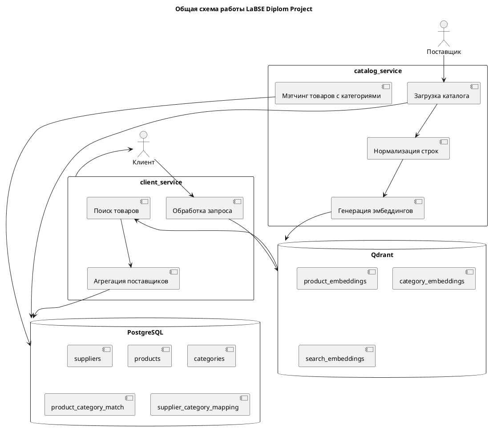
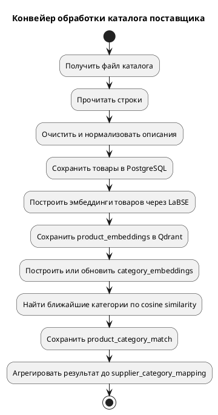

# LaBSE Diplom Project

## v2.2

---

## Поднять проект из корня

```bash
docker compose up -d
```

---

## Запуск тестов

```bash
docker compose exec catalog_service sh -lc "python -u test/run_pytest.py"
```

Тестовый запуск создаёт отдельную базу данных `diploma_test`, очищает тестовую схему, пересоздаёт тестовые коллекции Qdrant и применяет миграции Alembic.

---

## Структура проекта

```text
Diploma/
├── catalog/                 # сервис обработки каталогов поставщиков
│   ├── api/                 # API-ручки catalog_service
│   ├── services/            # бизнес-логика загрузки и обработки каталогов
│   ├── tasks/               # Celery-задачи
│   └── main.py              # FastAPI-приложение сервиса catalog
│
├── client/                  # сервис клиентского поиска поставщиков
│   ├── api/                 # API-ручки client_service
│   ├── services/            # обработка поисковых запросов
│   └── main.py              # FastAPI-приложение сервиса client
│
├── shared/                  # общий пакет проекта
│   ├── core/                # конфигурация и загрузка модели
│   ├── db/                  # PostgreSQL, Qdrant, ORM-модели
│   └── services/            # нормализация, эмбеддинги, мэтчинг
│
├── metrics/                 # расчёт метрик качества
│
├── migrations/              # Alembic-миграции PostgreSQL
│
├── test/                    # интеграционные тесты и тестовые данные
│
├── docker-compose.yml       # описание контейнеров проекта
├── Dockerfile.app           # Dockerfile приложения
├── requirements.txt         # Python-зависимости
└── README.md                # основное описание проекта
```

---

## Основные контейнеры Docker

```text
catalog_service   # API и логика обработки каталогов
client_service    # API клиентского поиска поставщиков
catalog_worker    # Celery worker для фоновой обработки каталогов
postgres          # реляционная база данных
qdrant            # векторная база данных
redis             # брокер сообщений для Celery
```

---

## Общая схема работы



---

## Упрощённый конвейер обработки каталога



---

## Основные сущности PostgreSQL

```text
suppliers                 # поставщики
products                  # товарные позиции из каталогов
categories                # справочник категорий
product_category_match    # связи товар — категория
supplier_category_mapping # агрегированные связи поставщик — категория
jobs                      # фоновые задачи обработки каталогов
```

---

## Основные коллекции Qdrant

```text
product_embeddings   # эмбеддинги товарных описаний
category_embeddings  # эмбеддинги категорий
search_embeddings    # эмбеддинги пользовательских запросов
```

---

## Основные API

### catalog_service

```text
POST  /catalog/upload
GET   /catalog/jobs/{job_id}
PATCH /categories/{category_id}
```

### client_service

```text
POST /search
```

---

