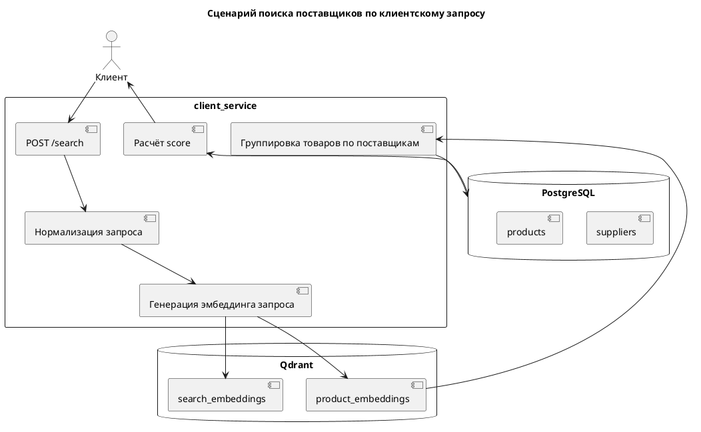

# client

Папка `client` содержит сервис пользовательского поиска поставщиков. 
Сервис принимает текстовый запрос клиента, строит его мультиязычный эмбеддинг с помощью LaBSE, выполняет поиск ближайших товарных позиций в Qdrant и возвращает ранжированный список поставщиков.

---

## Основной сценарий работы

```text
1. Пользователь отправляет текстовый запрос.
2. Сервис нормализует текст запроса.
3. Для запроса строится эмбеддинг LaBSE.
4. Эмбеддинг запроса сохраняется в Qdrant в коллекцию search_embeddings.
5. В Qdrant выполняется поиск ближайших товарных эмбеддингов в коллекции product_embeddings.
6. Из найденных точек извлекаются product_id и supplier_id.
7. Найденные товары группируются по поставщикам.
8. Для каждого поставщика рассчитываются avg_similarity, best_similarity и score.
9. Сервис возвращает ранжированный список поставщиков.
```

---

## Структура папки

```text
client/
├── api/
│   └── search.py       # API-ручка POST /search
│
├── services/
│   └── query.py        # основная логика обработки клиентского запроса
│
└── main.py             # FastAPI-приложение client_service
```

---

## Основная API-ручка

```text
POST /search
```

Назначение ручки — выполнить семантический поиск поставщиков по текстовому запросу пользователя.

---

## Пример запроса

```json
{
  "user_id": 101,
  "query_text": "авиационные комплектующие и детали для воздушных судов"
}
```

---

## Пример curl-запроса

```bash
curl -X POST "http://localhost:8001/search" \
  -H "Content-Type: application/json" \
  -d '{
    "user_id": 101,
    "query_text": "авиационные комплектующие и детали для воздушных судов"
  }'
```

---

## Пример ответа (его можно видоизменить до нужного фронту)

```json
{
  "results": [
    {
      "supplier_id": 1,
      "supplier_name": "Integration Supplier aviation_simplified",
      "score": 0.372214,
      "avg_similarity": 0.277705,
      "best_similarity": 0.412718,
      "matched_product_ids": [1, 2, 3, 4, 5]
    }
  ]
}
```

---

## Поля ответа

```text
supplier_id           # идентификатор поставщика
supplier_name         # название поставщика
score                 # итоговый показатель релевантности поставщика
avg_similarity        # среднее сходство найденных товаров поставщика с запросом
best_similarity       # максимальное сходство среди найденных товаров поставщика
matched_product_ids   # список товаров, из-за которых поставщик попал в выдачу
```

---

## Расчёт итогового score

В текущей версии итоговый показатель релевантности поставщика рассчитывается по формуле:

```text
score = 0.7 × best_similarity + 0.3 × avg_similarity
```

Где:

```text
best_similarity — максимальное косинусное сходство среди найденных товаров поставщика;
avg_similarity  — среднее косинусное сходство найденных товаров поставщика;
score           — итоговый показатель, по которому сортируется выдача.
```

---

## Используемые данные

Сервис `client` использует данные из двух хранилищ.

### Qdrant

```text
product_embeddings   # эмбеддинги товарных позиций
search_embeddings    # эмбеддинги пользовательских запросов
```

### PostgreSQL

```text
suppliers   # данные о поставщиках
products    # данные о товарных позициях
```

---

## Связь с catalog-сервисом

Сервис `client` не загружает каталоги и не строит товарную базу с нуля. Он работает поверх данных, подготовленных сервисом `catalog`.

Общая логика такая:

```text
catalog_service → обрабатывает каталоги → создаёт product_embeddings
client_service  → ищет по product_embeddings → возвращает поставщиков
```

---

## UML-схема клиентского поиска




---

## Swagger / OpenAPI

После запуска сервиса интерактивная документация доступна по адресу:

```text
http://localhost:8001/docs
```

OpenAPI-схема:

```text
http://localhost:8001/openapi.json
```

---

## Важные особенности

```text
1. Поиск выполняется не по категориям, а по товарным эмбеддингам.
2. После поиска товаров результаты группируются по supplier_id.
3. Поставщик попадает в выдачу, если в его каталоге найдены релевантные товарные позиции.
4. Чем выше score, тем выше поставщик в итоговой выдаче.
5. Запросы пользователей также сохраняются в Qdrant для последующего анализа.
```

---

## Связанные модули

```text
shared.services.preprocessing  # нормализация текста запроса
shared.services.embedding      # генерация эмбеддинга запроса
shared.services.matcher        # поиск поставщиков по query_vector
shared.db.qdrant               # поиск в Qdrant
shared.db.postgres             # доступ к PostgreSQL
shared.db.models               # ORM-модели
```